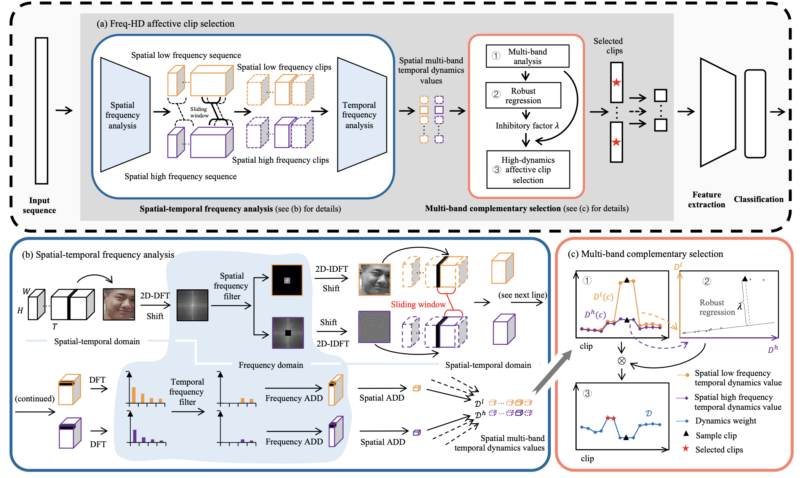

# Freq-HD

Freq-HD: An Interpretable Frequency-based High-Dynamics Affective Clip Selection Method for in-the-Wild Facial Expression Recognition in Videos, in *ACM MM 2023*, **Oral**. [[Paper]](https://dl.acm.org/doi/abs/10.1145/3581783.3611972)

## Approach



## Usage

```bash
$ pip install -r requirements.txt
```

## How to run

For the Spatial-temporal frequency analysis (STFA) module and the Multi-band complementary selection (MBC) module in the Freq-HD paper, the corresponding codes are located in drawpic.py and clipselection.py, respectively.

Execute

```bash
$ python drawpic.py
```

to obtain the results of the STFA module and the selection outcomes of the Freq-HD method.

## Citation

If you use this code in your research, please kindly cite the following papers

```
@inproceedings{tao2023freq,
  title={Freq-HD: An Interpretable Frequency-based High-Dynamics Affective Clip Selection Method for in-the-Wild Facial Expression Recognition in Videos},
  author={Tao, Zeng and Wang, Yan and Chen, Zhaoyu and Wang, Boyang and Yan, Shaoqi and Jiang, Kaixun and Gao, Shuyong and Zhang, Wenqiang},
  booktitle={Proceedings of the 31st ACM International Conference on Multimedia},
  pages={843--852},
  year={2023}
}
```
